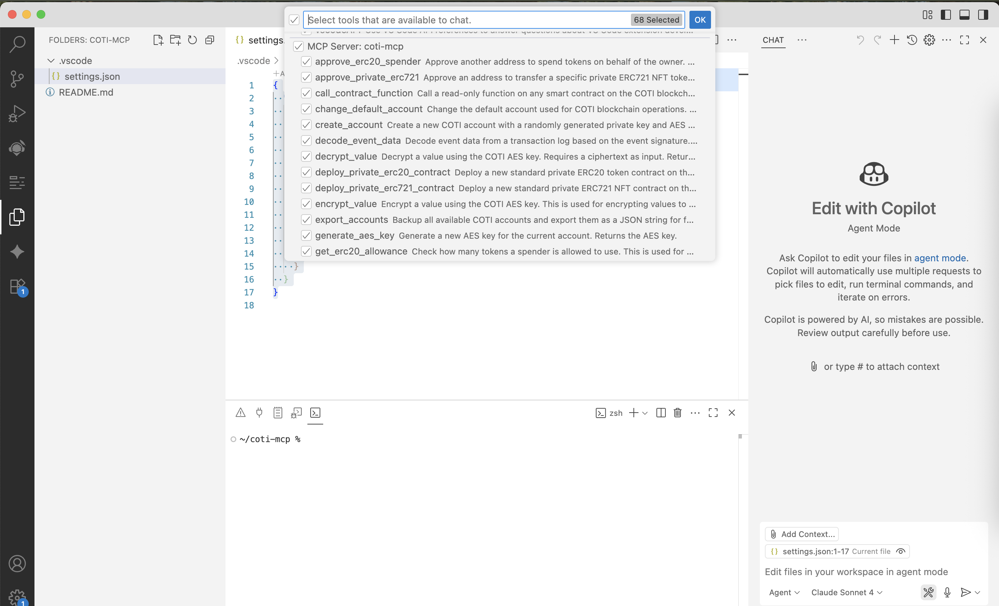

# COTI MCP Server Setup Guide

A Model Context Protocol (MCP) server for interacting with the COTI blockchain.

## Prerequisites

Before getting started, make sure you have the following installed:

- **Visual Studio Code** - Download from [code.visualstudio.com](https://code.visualstudio.com/)
- **GitHub Copilot extension** - Install from VS Code marketplace
- **COTI Metamask Snap** - [beta here](https://github.com/YaruLabs/coti-snap-fork)
- **Node.js and npm** - Download from [nodejs.org](https://nodejs.org/)
- **MCP extension for VS Code** - Required to use MCP servers
- Clone this tutorial on a new project on VS Code.

  ```git
  git clone https://github.com/plucena/coti_mcp
  ```

## VS Code Setup

1. **Install the MCP extension** in VS Code from the marketplace.
2. **Create the MCP configuration file** by creating `.vscode/settings.json` in your workspace root:

```json
{
  "mcpServers": {
    "coti-mcp": {
      "command": "npx",
      "args": [
        "-y",
        "@smithery/cli@latest",
        "run",
        "@davibauer/coti-mcp",
        "--key",
        "d1747d1b-7003-4b13-9393-b6d70d07732f",
        "--profile",
        "unlikely-whitefish-v7J617"
      ]
    }
  }
}
```

3. **Restart VS Code** to load the new configuration.
4. **Verify the setup** by checking that you can see the `coti-mcp` tools in the GitHub Copilot panel, by clicking the "tools"icon on the right bar on the corner.



> ⚠️ **Important**: Only proceed if you can see the coti-mcp tools in your VS Code interface.

## Creating the Capybara Token

Follow these steps to create and deploy a private ERC20 token on the COTI testnet.

### Step 1: Create a New Account

Create a new COTI account to deploy your smart contract:

```
create_account - coti-mcp
```

**Expected Output:**

```
Great! I've successfully created a new COTI account for you. Here are the details:
Account Address: 0x...
```

### Step 2: Fund Your Account

Fund your new account using the COTI testnet faucet:

1. Go to [faucet.coti.io](https://faucet.coti.io) Discord server
2. Type the following command in the faucet channel:

```
testnet YOUR_NEW_ADDRESS_HERE
```

**Expected Output:**

```
COTI-Faucet
xxxx faucet transferred 10 COTI (testnet)
```

### Step 3: Generate AES Key

Generate an AES key for your account to enable private transactions:

```
generate aes_key
```

**Expected Output:**

```
Perfect! I've successfully generated an AES key for your COTI account:
Account Address: 0x...
AES Key: 0x...
```

### Step 4: Deploy the Private Token Contract

Deploy your CAPYBARA token contract with the following parameters:

```
deploy_private_erc20_contract CAPYBARA CPB 6 decimals
```

**Expected Output:**

```
Excellent! I've successfully deployed a private ERC20 contract on the COTI blockchain.
Contract Address: 0x...
Transaction Hash: 0x...
```

### Step 5: Verify Deployment

Check your deployed contract on the COTI testnet explorer:

1. Visit [testnet.cotiscan.io](https://testnet.cotiscan.io)
2. Search for your contract address: `https://testnet.cotiscan.io/address/YOUR_SMART_CONTRACT_ADDRESS`

### Step 6: Add Token to Wallet

Add your newly created token to your wallet:

1. Open Metamask with COTI SNAP preinstalled.  Reffer to section 1 #Pre requisites.
2. Add custom token using your contract address
3. The token should appear with symbol `CPB` and name `CAPYBARA`

### Step 7: Mint Tokens

Mint some tokens to your wallet address:

```
mint 10 tokens to YOUR_ADDRESS_HERE
```

### Step 8: Verify Balance

Check your token balance in your wallet to confirm the minting was successful.

## Troubleshooting

- **MCP Server not visible**: Ensure you have the MCP extension installed and VS Code has been restarted
- **Account creation fails**: Check your internet connection and try again
- **Faucet not working**: Make sure you're using the correct Discord channel and format
- **Contract deployment fails**: Ensure your account has sufficient COTI balance for gas fees

## Additional Resources

- [COTI Documentation](https://docs.coti.io/)
- [COTI Testnet Explorer](https://testnet.cotiscan.io/)
- [COTI Discord](https://discord.gg/coti)
